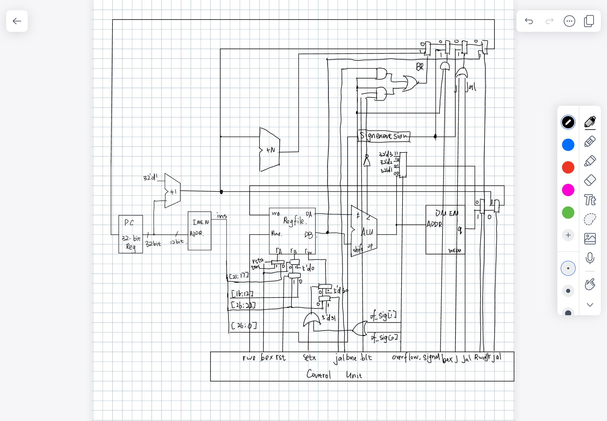

# ProjectCheckpoint5
- Name: Chen Gong  Yichu Wu
- NetID: cg387  yw718

# Overview
a) In this project, a single-cycle 32-bit processor is designed with the following modules:
- skeleton.v: top entity file which structures the clocks, instruction memory, data memory, register, and processor.

- processor.v: the file that constructs the whole datapath, including pc, imem, dmem, register, control unit.
  
- regfile.v: register file which can read from two input source registers and store data in a destination regiter.
  
- clock_divider.v: clock divider for the basic clock signal to be siutable for each module.
  
- control_unit.v: control signals based on operaction codes.
  
- dmem.v: data memorty

- imem.v: instruction memory

- dffe.v: 32bit register

- alu.v: ALU unit that construct arithmatic operation for registers and also for immediate values.

- mux1to4.v: 2 bit selction signal multiplexer to choose from 4 inputs.

b) Overall Processor Procedure
In this processor, a 32-bit register is used as the pc. Each time clock counts, current_pc will be equal to last next_pc, and new next_pc will be current pc add 1. Then, pc is used as address for instrunction memory from which 32-bit instruction code will be obtained. This instruction code represents different parts of the assembly code, and them are used to control each modules in this processor. Register takes source and destination register numbers from the instruction, and output values for ALU operation. ALU takes the control signals and perform corresponding arithmatic operation, and then output the results to data memory. Based on control signals, the data stored back to register or in the data memory will be clarified.

# Clock Configuration
- Processor Clock: Processor configues the whole operation, so it should be the slowest to allow all execution finish. Two clock dividers are used to configure processor clock.

- Regfile Clock: Register has the same clock as processor, because each cycle processor only write to register once and at the end of the execution.

- Imem Clock: Instruction memory should wait for the PC to be stable and then fetch instruction.

- Dmem Clock: Data memory should wait for ALU to finish operation and then operate, so it should wait for imem clock delay to finish and then statr to fetch.

Below is the clock configuration figure.


# Control Unit
Control unit takes ALUopcode, opcode, and overflow signal to generate control signals for each instruction. Main control code is shown in the following: 

```Verilog
	assign j = ~opcode[4]&~opcode[3]&~opcode[2]&~opcode[1]&opcode[0];
	assign bne = ~opcode[4]&~opcode[3]&~opcode[2]&opcode[1]&~opcode[0];
	assign jal = ~opcode[4]&~opcode[3]&~opcode[2]&opcode[1]&opcode[0];
	assign jr = ~opcode[4]&~opcode[3]&opcode[2]&~opcode[1]&~opcode[0];
	assign blt = ~opcode[4]&~opcode[3]&opcode[2]&opcode[1]&~opcode[0];
	assign bex = opcode[4]&~opcode[3]&opcode[2]&opcode[1]&~opcode[0];
	assign setx = opcode[4]&~opcode[3]&opcode[2]&~opcode[1]&opcode[0];
	
	assign Rwe = ~(sw | j |bne | jr | blt | bex);
	assign Rst = sw | bne | blt | jr;
	assign ALUinB = addi | sw | lw;
	assign DMwe = sw;
	assign Rwd = lw;

```

Control signals for sw, addi, lw, are generated based on their opcode and ALUopcode. For immediate type instruction, ALUopcode is set to be 5'd0 mannually. 
Because four signals need to be chosen from overflow signal, overflow signal is expanded to be 2 bits based on instruction operation. Code is shown below:
```Verilog
assign ctrl_of[0] = overflow & (add | sub);
assign ctrl_of[1] = overflow & (addi | sub);
```
In this way, corresponding numbers can be stored in the status register.

Finally, the ALUcontrol opcode is determined using the following code
```Verilog
assign ALUctrl = (addi | sw | lw) ? 5'd0 : ((bne | blt) ? 5'd1 : ALUopcode);
```


# Processor Datapath
Processor datapath is shown below:

In this figure, the 1to4 mux is used to choose the input to the register based on the overflow signal. And the data memory mux is used to select if data memory output data should be chosen to be input for register when lw is conducting. Otherwise, the mux should choose ALU output value for the register. A plus N unit is added to this datapath to conduct the PC branch to PC+1+N. Also, lots of mux based on the jumping control signals are also added to this processor so that the PC jump can be implemented based on these control signals.


